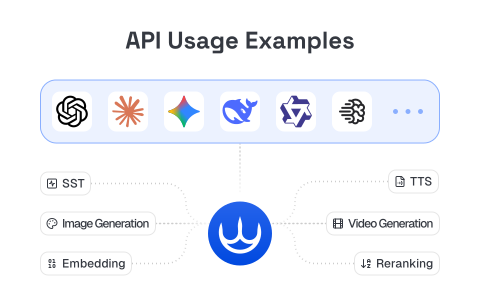

# inferHub
A public repository for developers to explore and experience pre-built API usage examples for inferEra. Access major LLMs through a unified interface with bilingual (English &amp; Chinese) quickstart guides. Build smarter, faster.

# Catalog


- README.md
- security_check.py # 密钥安全检查
- docs/
  - faq.md
- bento_card_artifacts # 便当卡片生成器  
  - bento-next-app # 主程序
    - README.md # 说明
    - script # Python 免编译版本，输出到 html_output 目录
- examples/
  - deepseek.py
  - Claude/
    - claude-official.py
    - claude-official-stream.py
    - claude-cache.py
    - textEdit.py
  - Gemini/
    - 2.5flash-image-with-image.py
    - 2.5flash-image.py
    - gemini_image_gen.py
    - nano-banana-edit.py
    - 2.0flash.py
    - 2.5flash.py
    - 2.5pro.py
    - 2.5_with_thinking.py
    - Code-execution.py
    - Gemini-2.5-reasoning-OAI.py
    - imagen.py
    - Image-understanding.py
    - Audio-understanding.py
    - Video-understanding.py
    - Video-understanding-url.py # Youtube 视频链接
    - OAI-reasoning_effort.py # 推理深度
    - 非流式.py
    - Gemini-Function-call.py
    - gemini-context-caching.py
    - veo3.0.py
    - veo3逆向.py
    - veo2.0.py
    - veo2.0-i2v.py
  - IdeogramAI 绘图/
    - v3_generate.py
    - v3_generate-with-reference.py
    - v3_edit.py
    - v3_remix.py
    - v3_replace-background.py
    - aihubmix_ideogram_generate.py
    - aihubmix_ideogram_describe.py
    - aihubmix_ideogram_edit.py
    - aihubmix_ideogram_remix.py
    - aihubmix_ideogram_upscale.py
    - img/
  - JinaAI/
    - jina_Embeddings.py # 向量嵌入
    - jina_Reranker.py # 重排序
    - jina_DeepSearch.py # 深度搜索
  - OAI/
    - Responses API/
      - gpt-5-series.py
      - Text_input.py
      - Image_input.py
      - imageGenerationTool.py
      - Streaming.py
      - Reasoning.py
      - Functions.py
      - Web_search.py
      - CodeInterpreter.py
      - RemoteMCP.py
    - 4o image/
      - image-1-generate.py
      - image-1-edit.py
      - image-1-edit-with-mask.py
      - image-1-generate-逆向兼容.py
      - 4o-image-逆向.py
      - 4o-image-i2i-逆向.py
      - 4o-image-is2i-逆向.py
    - tts-gpt.py
    - tts-audio-preview.py
    - tts-kokoro.py
    - tts-latency.py  # tts 延迟测试
    - FIM.py # 代码补全
  - Web/
    - inferEra-Grounding-with-Google.py
    - inferEra-surfing.py
  - Qwen
    - qwen2.5-vl.py
    - qwq.py
    - qwen-tools-regular.py
    - qwen3.py
    - qwen3-tools-and-mcp.py
- output/
- scripts/
  - Latency-and-Throughput.py # 计算模型的首 Token 延迟和吞吐量
- aihubmix_cli.py # AiHubMix API 命令行工具
- aihubmix_client.py # AiHubMix API 客户端库
- requirements.txt # 项目依赖
- LICENSE

## AiHubMix API 工具

我们提供了一个全功能的 AiHubMix API 命令行工具和客户端库，用于管理 AiHubMix API 和使用其服务。

### 准备工作

1. 一个 [AiHubMix 账户](https://aihubmix.com)
2. 从 AiHubMix 设置页面获取的访问令牌 (Access Token)
3. 安装必要的 Python 依赖项：
   ```bash
   pip install -r requirements.txt
   ```

### 命令行使用

```bash
# 获取账户余额
python aihubmix_cli.py --url "https://aihubmix.com" --token "YOUR_ACCESS_TOKEN" --action get_balance

# 创建新 KEY 
python aihubmix_cli.py --url "https://aihubmix.com" --token "YOUR_ACCESS_TOKEN" --action create_token --name "新 KEY 名称"

# 获取 KEY 列表
python aihubmix_cli.py --url "https://aihubmix.com" --token "YOUR_ACCESS_TOKEN" --action get_tokens

# 搜索 KEY（注意名称必须完整匹配，大小写不敏感）
python aihubmix_cli.py --url "https://aihubmix.com" --token "YOUR_ACCESS_TOKEN" --action search_tokens --query "搜索关键词"

# 更新 KEY 
python aihubmix_cli.py --url "https://aihubmix.com" --token "YOUR_ACCESS_TOKEN" --action update_token --id "KEY ID" --name "新名称"

# 删除 KEY 
python aihubmix_cli.py --url "https://aihubmix.com" --token "YOUR_ACCESS_TOKEN" --action delete_token --id "KEY ID"

# 获取可用模型
python aihubmix_cli.py --url "https://aihubmix.com" --token "YOUR_ACCESS_TOKEN" --action get_models

# 获取用户可用模型
python aihubmix_cli.py --url "https://aihubmix.com" --token "YOUR_ACCESS_TOKEN" --action get_available_models

# 获取用户 KEY 
python aihubmix_cli.py --url "https://aihubmix.com" --token "YOUR_ACCESS_TOKEN" --action get_user_token
```

### Curl 示例

如果你希望直接使用 curl 命令访问 AiHubMix API，以下是一些示例：

```bash
# 获取账户余额
curl -X GET "https://aihubmix.com/api/user/self" \
  -H "Authorization: YOUR_ACCESS_TOKEN" \
  -H "Content-Type: application/json"

# 获取 KEY 列表
curl -X GET "https://aihubmix.com/api/token/" \
  -H "Authorization: YOUR_ACCESS_TOKEN" \
  -H "Content-Type: application/json"
```

#### 使用配置文件

你可以将 URL 和访问令牌保存到配置文件中，避免每次都需要输入：

```bash
# 保存配置
python aihubmix_cli.py --save-config --url "https://aihubmix.com" --token "YOUR_ACCESS_TOKEN"

# 使用已保存的配置执行操作
python aihubmix_cli.py --action get_balance

# 你仍然可以覆盖已保存的配置
python aihubmix_cli.py --url "https://api.aihubmix.com" --action get_balance
```

配置文件保存在 `~/.aihubmix.json`。

#### 以 JSON 格式输出

以 JSON 格式输出：

```bash
python aihubmix_cli.py --url "https://aihubmix.com" --token "YOUR_ACCESS_TOKEN" --action get_balance --json
```

查看完整的命令行选项：

```bash
python aihubmix_cli.py --help
```

### 在 Python 中使用客户端库

```python
from aihubmix_client import AiHubMixClient

# 创建客户端
client = AiHubMixClient(api_url="https://aihubmix.com", access_token="YOUR_ACCESS_TOKEN")

# 获取账户余额
balance = client.get_balance()
if balance and balance.get("success", False):
    user_data = balance.get("data", {})
    print(f"当前余额: {user_data.get('quota', '未知')}")

# 创建新 KEY 
token = client.create_token(token_name="新 KEY 名称")
if token and token.get("success", False):
    token_data = token.get("data", {})
    print(f"新 KEY : {token_data.get('key', '未知')}")

# 获取可用模型
models = client.get_models()
if models and models.get("success", False):
    models_data = models.get("data", {})
    # 处理模型数据...
```

### AiHubMixClient API 参考

`AiHubMixClient` 类提供以下主要方法：

#### KEY 管理
- `create_token(token_name, expires_in=None, remaining_quota=None)` - 创建新的 API KEY 
- `get_tokens()` - 获取所有 API KEY 
- `search_tokens(query)` - 搜索 API KEY 
- `get_token(token_id)` - 获取特定 API KEY 
- `update_token(token_id, **kwargs)` - 更新 API KEY 
- `delete_token(token_id)` - 删除 API KEY 

#### 账户和用户信息
- `get_balance()` - 获取账户余额信息
- `get_user_self()` - 获取当前用户信息
- `update_user_self(**kwargs)` - 更新当前用户信息
- `get_user_token()` - 获取用户 KEY 

#### 模型信息
- `get_models()` - 获取所有可用模型
- `get_available_models()` - 获取用户可用模型

### 故障排除

如果遇到问题，可以尝试以下解决方案：

1. **连接问题**：如果主域名连接失败，尝试使用备用域名：
   ```bash
   python aihubmix_cli.py --url "https://api.aihubmix.com" --token "YOUR_ACCESS_TOKEN" --action get_balance
   ```

2. **访问令牌无效**：确保提供的访问令牌是从 AiHubMix 网站获取的有效密钥。访问令牌格式通常是 `fd***` 这样的形式。

3. **权限不足**：某些操作可能需要特定的权限，请确保你的账户有足够的权限。

4. **请求失败**：检查网络连接，或尝试稍后再试。

## 注意事项

- 访问令牌需要在 [AiHubMix 设置页面](https://aihubmix.com/setting) 点击「生成系统访问令牌」生成
- 访问令牌与用于访问 AI 模型的普通 API KEY 不同
- 每个用户拥有自己的系统访问令牌，其访问级别由用户角色决定（普通用户、管理员或根用户）
